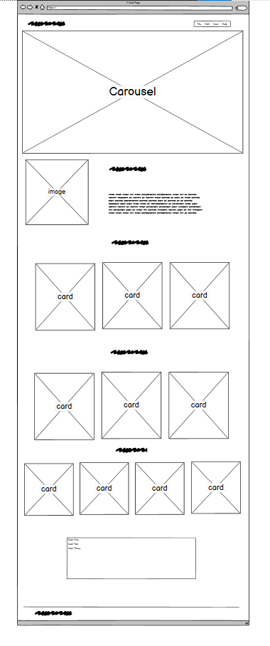

# Explorage-Mini-Project

[Live webpage]()

## Project Overview

To produce a 1 page responsive site with links in a day to show how I can apply my knowledge from my course as part of my application for a role as Junior Develooper with Explorage. The project is based on providing storage solutions.

## Project Goals 

### User Goals

- To be able to navigate the site via links on the nav bar
- To get a quick understanding of what the site is about
- to be aware of what the company offers, what the company does, past projects, and the staff
- to be able to contact the company

### Site Owner Goals

- To get users to be aware of what the company offers, what the company does, past projects, and who the staff are and make an enquiry

### Target Audience

- For Explorage dev team and CEO

## Design

### Design Choices
The carousel was selected so that images and text could be displayed clearly and effectively. Cards were chosen to display within the varous sections of the site so that information and images are clearly defined.

### Colour

The backround colour was selected to keep the site simple and crisp whist allowing good contrast for the cards and text. #e8ebec

### Fonts

Google fonts was utilised and the font Montserrat with weights of 300, 400 and 500 selected. this was chosen as it is a clear easy to read font.

### Structure

The page is structured as 1 page with links to the different sections.

### Wireframes

## Technologies Used

### Languages
- HTML
- CSS

### Tools

- GitHub
- Gitpod
- Balsamiq
- Bootstrap
- Google Fonts
- Font Awesome
- Bootsrap fonts

## Features
- The website consists of 1 page and 6 features

### Logo and Navigation Bar
- Features fixed at the top of the page
- The navbar responds fully and includes links to sections of site  Home, about, services, portfolio, team and Contact.
- It allows users to easily navigate around the website

### Carousel

- 3 x images with text referencing what the company offers

### About

- brief description about the company

### services

- 3 cards explaining the services of the company

### portfolio

- 3 x cards with images and titles of past items to be stored

### Team

- 4 cards with an image and bio of staff members

### Contact

- A form for clients to contact the company with an email, name and query fiels. A submit buttun is included.

## Deployment
The website was deployed using GitHub Pages by following these steps:
1. In the GitHub repository navigate to the Settings tab
2. On the left hand menu select Pages
3. For the source select Branch: master
4. After the webpage refreshes automaticaly you will se a ribbon on the top saying: " Your site is published at 

You can fork the repository by following these steps:
1. Go to the GitHub repository
2. Click on Fork button in upper right hand corner

You can clone the repository by following these steps:
1. Go to the GitHub repository 
2. Locate the Code button above the list of files and click it 
3. Select if you prefere to clone using HTTPS, SSH, or Github CLI and click the copy button to copy the URL to your clipboard
4. Open Git Bash
5. Change the current working directory to the one where you want the cloned directory
6. Type git clone and paste the URL from the clipboard ($ git clone https://github.com/YOUR-USERNAME/YOUR-REPOSITORY)
7. Press Enter to create your local clone.

## Credits

All images are taken from <a href= "https://unsplash.com/">pexels.com</a>  
the you-tube video by Divinictor which I based my site on and followed along to coding into gitpod 

## Acknowledgements

- Covid-19 for making me feel rotten whist I coded
- My unpowerful chromebook fo contantly lagging with too many apps open